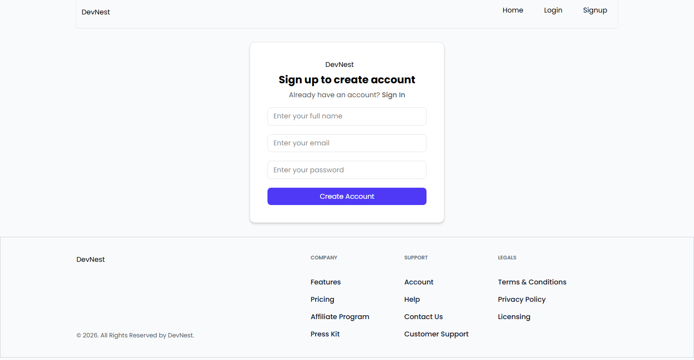
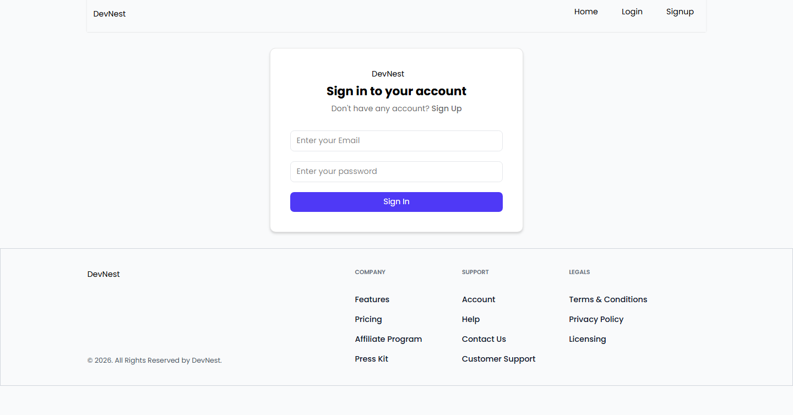
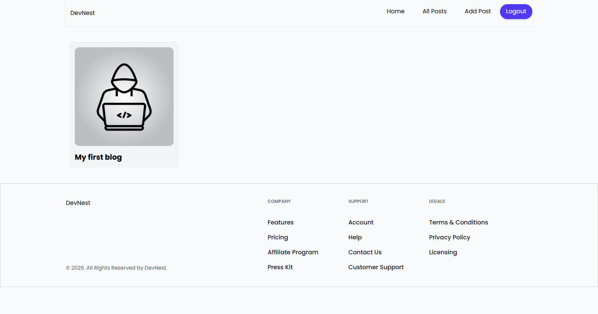
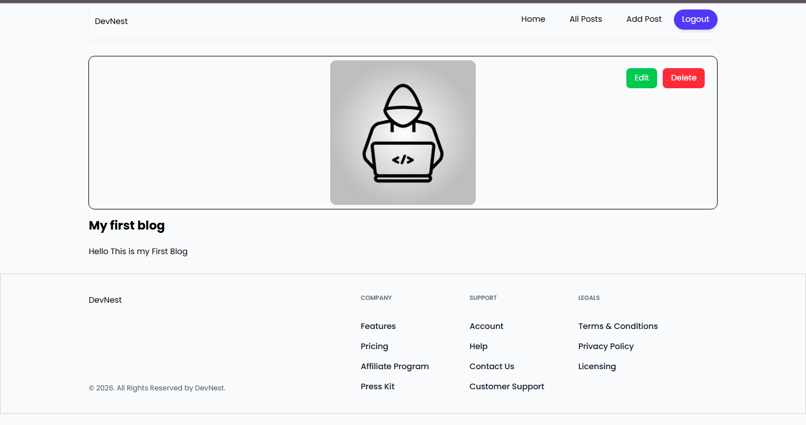
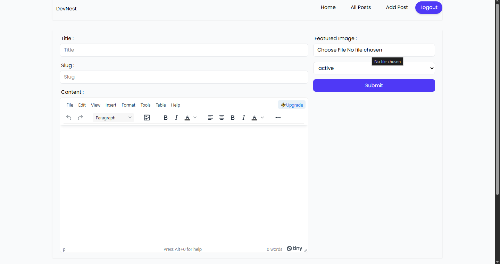

# DevNest - Blog Application

DevNest is a modern blog platform where users can create, read, update, and delete blog posts.  
The application provides a clean and responsive interface for sharing ideas and articles.

This project was built as part of my frontend development learning journey.

---

## 🚀 Features

- User Authentication (Signup / Login)
- Create Blog Posts
- Edit and Update Posts
- Delete Posts
- View All Blog Posts
- Responsive UI

---

## 🛠 Tech Stack

Frontend

- React
- React Router
- Redux Toolkit
- React Hook Form
- Tailwind CSS

Backend / Services

- Appwrite (Authentication, Database, Storage)

Editor

- TinyMCE Rich Text Editor

---

## ⚙️ Installation

1. Clone the repository

   git clone https://github.com/Kaushik-Mudaliyar/Devnest-Blog-App.git

2. Install dependencies

   npm install

3. Run the application

   npm run dev

---

## 📸 Screenshots

### Sign Up Page

### Login Page

### Home Page

### Post Page

### Add Post Page

## 

## 👨‍💻 Author

Kaushik Mudaliyar

Full Stack Developer | MERN Stack

## ⭐ Support

If you found this project useful, consider giving it a ⭐ on GitHub.
